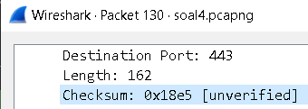
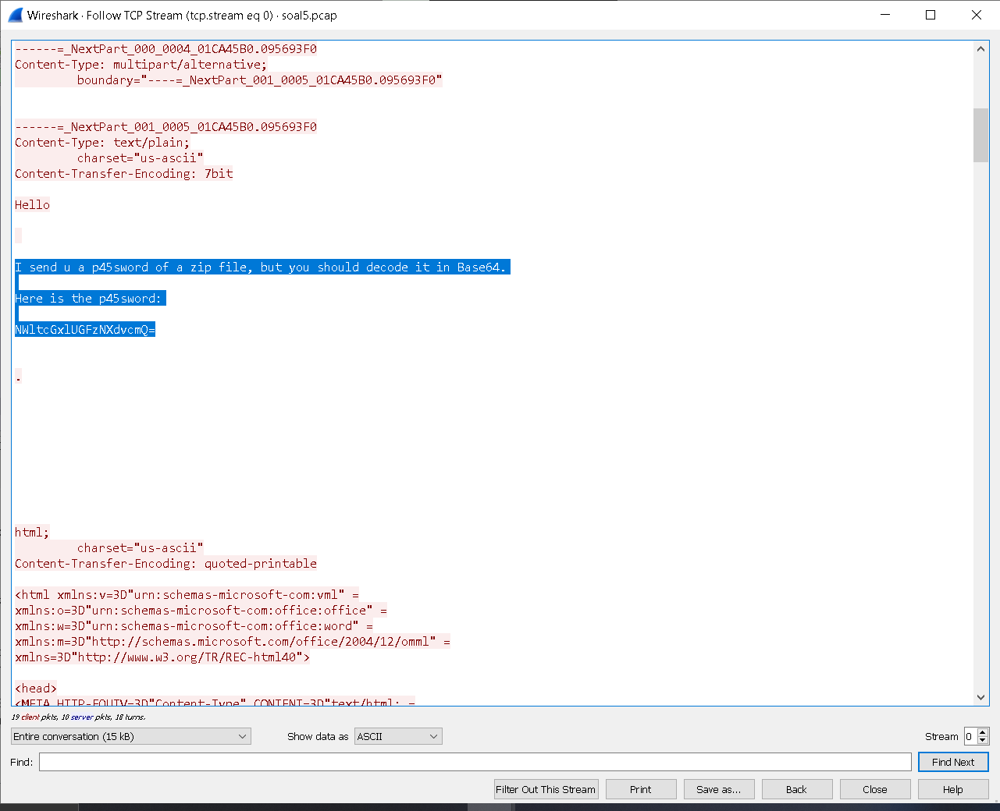

# Jarkom-Modul-1-D28-2023

Anggota Kelompok D28 :
1. Revanantyo Dwigantara - 5025211113
2. Charles = 5025211082

## No. 1
Soal :

```
User melakukan berbagai aktivitas dengan menggunakan protokol FTP. Salah satunya adalah mengunggah suatu file.
a. Berapakah sequence number (raw) pada packet yang menunjukkan aktivitas tersebut? 
b. Berapakah acknowledge number (raw) pada packet yang menunjukkan aktivitas tersebut? 
c. Berapakah sequence number (raw) pada packet yang menunjukkan response dari aktivitas tersebut?
d. Berapakah acknowledge number (raw) pada packet yang menunjukkan response dari aktivitas tersebut?
```

Pada soal pertama, kita dapat mencari paket yang melakukan unggah file yaitu dengan kata kunci `STOR`. Selain itu, kita harus mencari response dari `STOR` tadi, yang mana terlihat pada 2 packet di bawah `STOR`. 


Setelah itu, kita bisa buka packet `STOR` dan response dan didapatkan sequence number (raw) serta acknowledge number (raw) dari kedua packet tersebut.


Sehingga, jawaban dapat langsung kita masukkan ke dalam nc 10.21.78.111 12345 dan kita dapatkan flag-nya.


## No. 2
Soal :

`Sebutkan web server yang digunakan pada portal praktikum Jaringan Komputer!`

Untuk menyelesaikan soal ini, kita dapat melakukan filtering menggunakan `http.server`. Setelah itu, kita bisa langsung melihat web server apa yang digunakan pada portal praktikum Jaringan Komputer.


Kita dapatkan web server-nya yaitu gunicorn. Langsung saja kita masukkan ke dalam nc 10.21.78.111 13579.


## No. 3
Soal :
```
Dapin sedang belajar analisis jaringan. Bantulah Dapin untuk mengerjakan soal berikut:
a. Berapa banyak paket yang tercapture dengan IP source maupun destination address adalah 239.255.255.250 dengan port 3702?
b. Protokol layer transport apa yang digunakan?
```

Untuk menjawab soal ini, kita bisa melakukan filtering dengan mencari port 3702 saja.


Setelah itu, untuk menjawab soal a, kita bisa hitung saja jumlah packet yang IP source maupun destination-nya adalah 239.255.255.250 yaitu berjumlah 21.
Untuk menjawab soal b, kita bisa langsung saja lihat protocol apa yang digunakan.


Langsung saja kita bisa masukkan jawabannya ke dalam nc 10.21.78.111 13590.


## No. 4
Soal :

`Berapa nilai checksum yang didapat dari header pada paket nomor 130?`

Untuk menjawab soal ini kita bisa langsung saja mencari packet nomor 130 lalu lihat checksum-nya.



Setelah itu, bisa langsung kita masukkan ke dalam nc 10.21.78.111 13591.


## No. 5
Soal :
```
Elshe menemukan suatu file packet capture yang menarik. Bantulah Elshe untuk menganalisis file packet capture tersebut.
a. Berapa banyak packet yang berhasil di capture dari file pcap tersebut?
b. Port berapakah pada server yang digunakan untuk service SMTP?
c. Dari semua alamat IP yang tercapture, IP berapakah yang merupakan public IP?
```

Pada soal ini kita diberikan file pcap dan zip. File zip tersebut dikunci. Kita diharuskan untuk menemukan packet yang menarik dan membuka kunci zip untuk bisa menjawab soal di atas.


Tapi, sepertinya akan susah untuk mencari packet tersebut. Jadi, langkah yang bisa kita lakukan adalah dengan melihat semua lalu lintas jaringan yang terjadi dengan melakukan `follow tcp stream`. Pilih salah satu packet, lalu pilih `follow tcp stream` untuk melihat rekam jejak yang terjadi. Scroll ke bawah hingga kita menemukan jackpot.



Password yang kita dapat bisa kita decode dengan Base64. Sehingga, kita dapatkan password untuk membuka zipfile-nya.


Password tersebut kita gunakan untuk membuka zipfile dan kita bisa dapatkan host serta port untuk netcat-nya.
Setelah itu, untuk menjawab pertanyaan a, kita hanya perlu lihat berapa banyak packet yang ter-capture, yaitu 60.

Untuk menjawab soal b, kita bisa melihat port yang digunakan pada packet yang protocol-nya SMTP, yaitu 25.

Pada soal c, karena hanya ada 2 IP yang ter-capture, kita bisa mencoba satu-satu dan ternyata yang merupakan IP public adalah 74.53.140.153.


## No. 6
Soal : 

`Seorang anak bernama Udin Berteman dengan SlameT yang merupakan seorang penggemar film detektif. sebagai teman yang baik, Ia selalu mengajak slamet untuk bermain valoranT bersama. suatu malam, terjadi sebuah hal yang tak terdUga. ketika udin mereka membuka game tersebut, laptop udin menunjukkan sebuah field text dan Sebuah kode Invalid bertuliskan "server SOURCE ADDRESS 7812 is invalid". ketika ditelusuri di google, hasil pencarian hanya menampilkan a1 e5 u21. jiwa detektif slamet pun bergejolak. bantulah udin dan slamet untuk menemukan solusi kode error tersebut.`

Dari soal di atas kita pertama-tama dapat menganalisa soal terlebih dahulu. Berdasarkan pengamatan, huruf kapital pada paragraf tidaklah mengikuti standar KBBI. Sehingga jika kita mengambil seluruh huruf kapitalnya akan termuncul sebuah kata `SUBSTITUSI`. Setelah itu terdapat hint `server SOURCE ADDRESS 7812 is invalid` dan `a1 e5 u21`. Mari kita selesaikan satu per satu.

Untuk `server SOURCE ADDRESS 7812 is invalid` dapat kita gunakan wireshark untuk mencari packet ke 7812 dari file PCAP yang diberikan. `.


Setelah itu kita dapat mengambil source address packet tersebut yakni, `104.18.14.101


Kemudian ada hint tadi `SUBSTITUSI` dan `a1 e5 u21`. Ini berarti kita diminta untuk mensubstitusikan source address yang sudah kita dapat dengan metode cipher a1z26. Kita dapat menggunakan website online untuk cipher tersebut, salah satunya seperti website https://planetcalc.com/4884/ yang saya gunakan untuk melakukan substitusi tersebut. Jika kita langsung melakukan cipher tanpa mengubah apa-apa akan didapatkan hasil sebagai berikut.


Tetapi karena dari hint diberitahukan bahwa yang di cipher adalah angka 1-18. Kita dapat mencoba untuk memisah source address hingga memenuhi parameter tersebut. Hasilnya adalah sebagai berikut. 


Sekarang dapat kita coba masukkan jawaban di terminal. 


Seperti yang dilihat, jawaban benar dan kita berhasil mendapatkan flag.


## No. 7
Soal : 

`Berapa jumlah packet yang menuju IP 184.87.193.88?`

Untuk menjawab soal ini kita perlu menggunakan filter pada file PCAP yang diberikan. Filter yang kita gunakan yakni `ip.dst == 184.87.193.88`.


Dari filter tersebut dapat kita lihat pada bagian kanan bawah yang menunjukkan jumlah paket yang menuju IP 184.87.193.88, yaitu berjumlah 6.


Setelah itu dapat kita coba submit jawaban ke terminal.


Seperti yang dilihat, kita mendapatkan jawaban benar dan mendapatkan flag.


## No. 8
Soal : 

`Berikan kueri filter sehingga wireshark hanya mengambil semua protokol paket yang menuju port 80! (Jika terdapat lebih dari 1 port, maka urutkan sesuai dengan abjad)`

Untuk soal ini kita cukup membaca referensi pada modul https://github.com/arsitektur-jaringan-komputer/Modul-Jarkom/tree/master/Modul-1. Dikarenakan diminta kueri filter menuju port 80, terdapat dua port yang perlu kita tulis yaitu tcp dan udp. Sehingga didapatkan queri berupa `tcp.dstport == 80 || udp.dstport == 80`.

Hasil setelah mengsubmit jawaban ke terminal adalah sebagai berikut.


## No. 9
Soal : 

`Berikan kueri filter sehingga wireshark hanya mengambil paket yang berasal dari alamat 10.51.40.1 tetapi tidak menuju ke alamat 10.39.55.34!`

Sama seperti no 8, kita bisa membaca modul untuk mencari tahu cara untuk melakukan filter sesuai permintaan soal, yakni `ip.src == 10.51.40.1 && ip.dst != 10.39.55.34`. Pada soal ini kita berfokus untuk memanipulasi relational operator untuk mendapatkan jawaban yang diinginkan.

Hasil submit jawaban ke terminal adalah sebagai berikut. 


## No. 10
Soal : 

`Sebutkan kredensial yang benar ketika user mencoba login menggunakan Telnet`

Untuk soal ini saya menggunakan referensi youtube https://youtu.be/GY_0TeV8Juw?si=pheIKm1YrbCypZ4L sebagai panduan dalam mengerjakan soal ini. Dikarenakan kita ingin mencari kredensial user yang mencoba login menggunakan telnet. Kita dapat mencoba melakukan filter dengan kueri `tcp contains "Password". 


Setelah itu kita dapat melakukan follow stream seperti berikut.


Setelah melakukan follow, kita akan mendapatkan hasil seperti ini.


Dari hasil tersebut kita mendapatkan username berupa `dhafin` (username tidak berupa ddhhaaffiin karena berdasarkan youtube tersebut ketika melakukan login, nama username akan agak menjadi double seperti itu). Kita juga berhasil mendapatkan password berupa `kesayangannyak0k0`. Kita dapat mencoba mengsubmit jawaban ke terminal setelah menemukan username dan password tersebut.


Bisa dilihat kita berhasil mendapatkan flag setelah mengsubmit jawaban tersebut.


